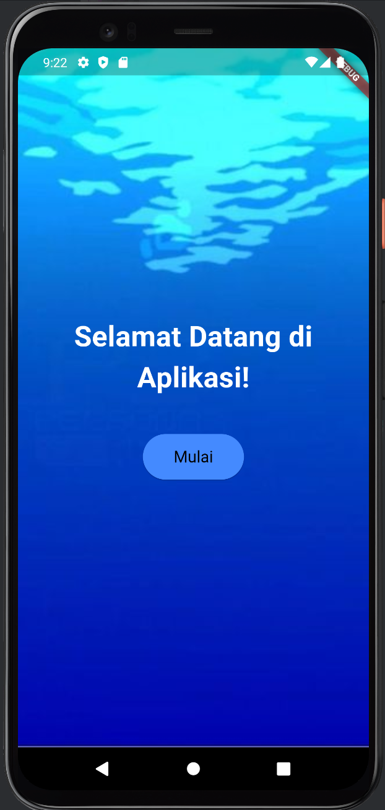
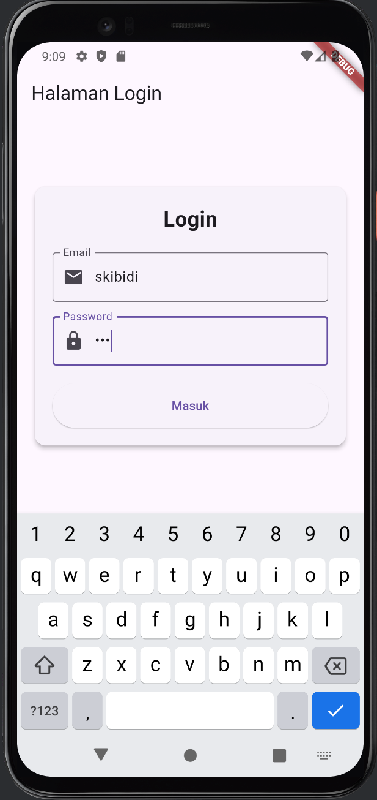
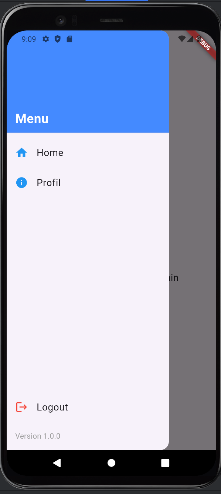

Nama       : Afiftha Ravi Aufa

NIM        : H1D022095

Shift Baru : A

## Penjelasan Program 

### welcomepage.dart
Halaman utama saat aplikasi dibuka dan sebelum login

### loginpage.dart
Halaman ini menyediakan antarmuka untuk pengguna melakukan login ke aplikasi. Terdapat formulir dengan input untuk email dan password, serta tombol untuk masuk ke aplikasi. 

### homepage.dart
Halaman utama aplikasi setelah pengguna berhasil login. Di sini, pengguna dapat melihat konten utama atau fitur yang disediakan oleh aplikasi dimana pada tugas ini adalah Artikel

### sidemenu.dart
Menu samping yang menyediakan navigasi tambahan ke halaman-halaman lain dalam aplikasi, seperti profil, pengaturan, atau fitur lainnya. SideMenu ini dapat diakses dari setiap halaman di dalam aplikasi, memudahkan pengguna berpindah antar halaman dengan cepat dan efisien.

### profilpage.dart
Halaman ini menampilkan profil pengguna, di mana pengguna dapat melihat informasi akun

### Screenshot Aplikasi

 
 
 
 
 

